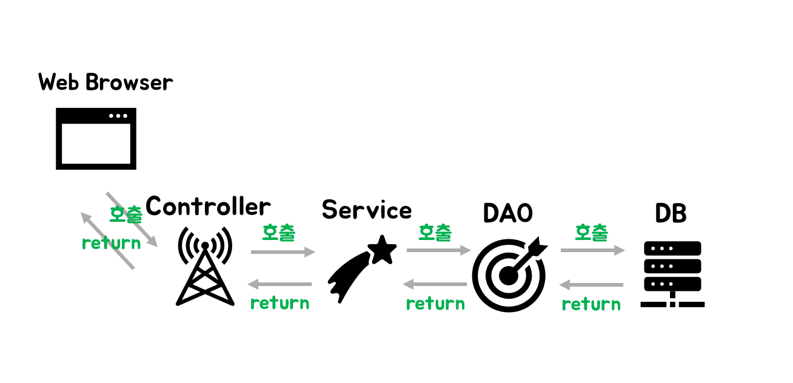
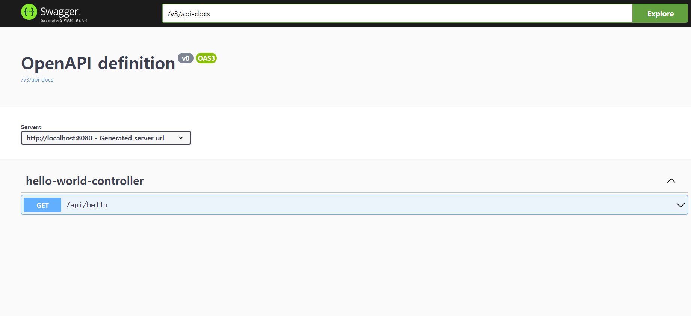

# React + Spring 연동 페이지 구축

### 1. Spring Boot로 프로젝트 생성하기  
- Spring Boot 사이트(https://start.spring.io/) 접속 후 프로젝트 생성 (이때 Dependency는 Spring Web 추가할 것)
- 생성된 프로젝트를 개인 IDE에서 실행 (java 경로에 생성된 프로젝트명.java 파일에서 Run(F5)으로 실행)
- Controller 추가 후 프로젝트 실행하기 (초기 Port : 8080) 테스트는 localhost:8080/hello 로 호출하면 json 데이터를 Return 받을 수 있다. 
  

### 2. React 프로젝트 생성하기 
- `npx create-react-app 프로젝트명` 프로젝트 생성 
- `npm start`으로 프로젝트 실행
  

### 3. Proxy Server 설정하기  
로컬 환경에서 개발할 경우 React(Front-End)와 Spring(Back-End)을 각각 실행 후 통신해야된다. 그런데 두 프로젝트의 url이 다르기 떄문에 React 쪽에서 통신할 kv때 CORS문제가 발생해 통신할 수 없다. 그렇기에 개발 시에는 Proxy Server를 설정하여 CORS를 방지하는 것이다.   <a href="https://create-react-app.dev/docs/proxying-api-requests-in-development/">공식문서</a>에 Proxy Server를 설정하는 방법을 참고하여 아래와 같이 설정한다.  

- `npm install http-proxy-middleware --save ` 명령어로 라이브러리 설치
- src 경로에 setupProxy.js 파일 생성 후 아래와 같이 소스 작성  
```javascript
const { createProxyMiddleware } = require('http-proxy-middleware');

module.exports = function(app) {
  app.use(
    '/api', //개발 환경에서 해당 경로로 시작하는 url 호출 시 proxy Server를 사용
    createProxyMiddleware({
      target: 'http://localhost:8080',
      changeOrigin: true,
    })
  );
};
```

Proxy Server설정을 완료했다면 이제 React에서 아래와 같이 경로 설정 후 호출하면 개발 환경에서는 Proxy Server로 호출하고 빌드 후 배포한 운영 환경에서는 동일한 주소이기에 Path로 바로 접근한다.
```javascript
useEffect(()=>{
    fetch("/api/hello")
      .then((response) => {
        console.log(response.json())
        return;
      })
      .then(function (data) {
        setMessage(data);
      });
  }, []);

```  

### 4. Spring + DBMS + MyBatis 연동하기 
MyBatis를 세팅하기 전에 어떤 흐름으로 처리되는지 알아야된다. MyBatis 환경에서 구성할 때 사용되는 것은 Controller, Service, DAO, DTO, Mapper가 있다.
  
- Controller : 웹 브라우저의 요청을 담당. Controller가 Service를 호출한다.
- Service : Service는 비즈니스 로직을 수행한다. DB에 접근하는 DAO를 이용해서 결과값을 받는다.
- DAO : DAO는 데이터베이스에 접속하여 비즈니스 로직 실행에 필요한 쿼리를 호출한다. 이 예시에서는 DAO 대신 Mapper를 사용한다.
- DTO : Data Transfer Object의 약자로 각 계층이 데이터를 주고받을 때 사용하는 객체이다.

이제 MyBatis를 Spring 환경에서 적용해보자. Spring 프로젝트 폴더에 있는 build.gradle 파일에 아래 소스를 추가한다. 
- build.gradle
```gradle
    //Db Connect -- 1
	implementation 'org.springframework.boot:spring-boot-starter-jdbc'
    
    //Db Connect -- 2
    implementation 'com.microsoft.sqlserver:mssql-jdbc'
    
    // MyBatis
    implementation("org.mybatis.spring.boot:mybatis-spring-boot-starter:3.0.1")
    implementation("org.mybatis:mybatis:3.4.5")
```
- resources/application.properties  
  mybatis.mapper.location은 이후 xml 파일을 읽을 때 사용된다. 경로 주의할 것
```
spring.datasource.driverClassName=com.microsoft.sqlserver.jdbc.SQLServerDriver
spring.datasource.url=jdbc:sqlserver://서버 주소;databaseName=DB명;encrypt=true;trustServerCertificate=true
spring.datasource.username=아이디
spring.datasource.password=비밀번호

mybatis.mapper-locations=/mybatis/**/*.xml
```  
- resourses/mybatis/sample.xml  
  mybatis 폴더를 만들고 하위경로에 xml 파일을 생성한다. 예제에서는 MyBatis로 Result를 ResulType를 이용해 VO로 처리할 것이다.
  - ResultType :클래스를 가져오는 역할
  - VO : Value Object 형식으로 리턴  

```xml
<?xml version="1.0" encoding="UTF-8"?>
<!DOCTYPE mapper PUBLIC "-//mybatis.org//DTD Mapper 3.0//EN" "http://mybatis.org/dtd/mybatis-3-mapper.dtd">

<mapper namespace="com.example.spring_react_test.sample.mapper.SampleMapper">
    <select id="selectEmpAll" resultType="com.example.spring_react_test.sample.dto.empVo">;
        SELECT UserId, DeptNm, UserNm, DutyNm
          FROM USER_Table WITH(NOLOCK)                  
    </select>
    <select id="selectEmp" resultType="com.example.spring_react_test.sample.dto.empVo">;
        SELECT UserId, DeptNm, UserNm, DutyNm
          FROM TCO_USER WITH(NOLOCK)       
         WHERE User_Table LIKE '%' + #{name} + '%'           
    </select>
</mapper>

``` 

- java\com\example\spring_react_test\sample\vo\empVo.java  
이제 DB 쿼리를 통해 데이터를 받을 때 사용할 객체(DTO)를 만들어야 된다.
```java
package com.example.spring_react_test.sample.dto;

public class empVo { 
    private String UserId;
    private String DeptNm;
    private String UserNm;
    private String DutyNm;

    public String getUserId() {return UserId;}
    public void setUserId(String UserId) {this.UserId = UserId;}

    public String getDeptNm() {return DeptNm;}
    public void setDeptNm(String DeptNm) {this.DeptNm = DeptNm;}

    public String getUserNm() {return UserNm;}
    public void setUserNm(String UserNm) {this.UserNm = UserNm;}

    public String getDutyNm() {return DutyNm;}
    public void setDutyNm(String DutyNm) {this.UserId = DutyNm;}
}

```  
- java\com\example\spring_react_test\mapper\SampleMapper.java  
xml에서 작성한 쿼리를 실행하기 위해 Mapper를 생성한다.
```java
package com.example.spring_react_test.sample.mapper;

import java.util.List;
import com.example.spring_react_test.sample.vo.empVo;
import org.apache.ibatis.annotations.Mapper;
import org.apache.ibatis.annotations.Param;

@Mapper
public interface SampleMapper {    
    List<empVo> selectEmpAll();    

    List<empVo> selectEmp(@Param("name") String name);
}

```  
- java\com\example\spring_react_test\service\EmpService.java

```java
package com.example.spring_react_test.sample.service;

import com.example.spring_react_test.sample.mapper.SampleMapper;
import com.example.spring_react_test.sample.dto.empVo;

import org.springframework.beans.factory.annotation.Autowired;
import org.springframework.stereotype.Service;
import java.util.List;

@Service
public class EmpService {    
    @Autowired
    SampleMapper sampleMapper;

    public List<empVo> selectEmpAll(){
        return sampleMapper.selectEmpAll();
    }

    public List<empVo> selectEmp(String name){
        return sampleMapper.selectEmp(name);
    }
}

```  
- java\com\example\spring_react_test\controller\HomeController.java  
마지막으로 Controller에서 Service를 호출한다.
```java
package com.example.spring_react_test.sample.controller;

import org.springframework.beans.factory.annotation.Autowired;
import org.springframework.web.bind.annotation.GetMapping;
import org.springframework.web.bind.annotation.RequestParam;
import org.springframework.web.bind.annotation.RestController;

import com.example.spring_react_test.sample.service.EmpService;
import com.example.spring_react_test.sample.dto.empVo;

import java.util.List;

@RestController
public class HomeController {
    
    @Autowired
    EmpService service;

    @GetMapping("api/portal/selectEmpAll")    
    public Object[] selectEmpAll() {
        List<empVo> testList = service.selectEmpAll();
        return testList.toArray();
    }

    @GetMapping("api/portal/selectEmp")    
    public Object[] selectEmp(@RequestParam("name") String name) {
        List<empVo> testList = service.selectEmp(name);
        return testList.toArray();
    }
}
```

### 5. Gradle을 이용해서 프로젝트 빌드하기  
CI/CD 환경을 구축하기 위해서는 프로젝트가 잘 패키지화 될 수 있도록 해주어야한다.   
Spring 프로젝트 폴더에 있는 build.gradle 파일에 아래 소스를 추가한다. 
```gradle
//React Project를 빌드 시 추가하기위해 설정
def frontendDir = "$projectDir/src/main/client_app"

sourceSets {
    main {
        resources {
            srcDirs = ["$projectDir/src/main/resources"]
        }
    }
}

task installReact(type: Exec) {
    workingDir "$frontendDir"
    inputs.dir "$frontendDir"
    group = BasePlugin.BUILD_GROUP
    if (System.getProperty('os.name').toLowerCase(Locale.ROOT).contains('windows')) {
        commandLine "npm.cmd", "audit", "fix"
        commandLine 'npm.cmd', 'install'
    } else {
        commandLine "npm", "audit", "fix"
        commandLine 'npm', 'install'
    }
}

task buildReact(type: Exec) {
    dependsOn "installReact"
    workingDir "$frontendDir"
    inputs.dir "$frontendDir"
    group = BasePlugin.BUILD_GROUP
    if (System.getProperty('os.name').toLowerCase(Locale.ROOT).contains('windows')) {
        commandLine "npm.cmd", "run-script", "build"
    } else {
        commandLine "npm", "run-script", "build"
    }
}

task copyReactBuildFiles(type: Copy) {
    dependsOn "buildReact"
    from "$frontendDir/build"
    into "$buildDir/resources/main/static"
}

//배포시에만 빌드파일 포함
tasks.bootJar {
    dependsOn "copyReactBuildFiles"
}
```  
위 내용을 간단히 정리하면 Spring Boot 프로젝트가 build될 때 React 프로젝트를 먼저 build하고 결과물을 Spring Boot 프로젝트 build 결과물에 포함시킨다는 스크립트이다. 처리 순서는 processResources를 기점으로 installReact->buildReact->copyReactBuildFiles 순으로 실행된다. 

이제 build.gradle 파일 저장 후 프로젝트 경로에서 `./gradlew build` 명령어를 실행하여 Build를 진행한다. 만약 이때 `ERR_OSSL_EVP_UNSUPPORTED` 오류가 발생할 경우 React 프로젝트에 package.json 파일에 react-scripts 버전이 최신버전이 아니여서 Open SSL3 버전 규격에 어긋나 발생하는 오류이다. react-scrips 버전을 최신버전으로 변경 후 설치하면 오류가 해결된다.  

### 6. 서버에 배포하기  
Build된 파일은 프로젝트 build/lib 경로에 있으며 .jar 확장자로 저장된다. 프로젝트를 실행하려면 cli 환경에서 해당 경로로 이동 후 `java -jar [name-of-jar-file].jar`로 입력하면 프로젝트를 실행할 수 있고 localhost:8080으로 접속하면 React 화면이 나온다. 

실제 서버에 배포할 때는 해당 서버에 JDK를 설치하고 jar을 실행한 다음에 백그라운드로 jar을 `nohup java –jar [name-of-jar-file].jar &
` 명령어로 배포하면 된다. 이후 Tomcat으로 컴파일 경로를 설정하고 DNS 서버에서 IP와 호스트명을 일치시키면 웹 퍼블리싱 작업이 완료된다.  

  

### 7. springdoc-openapi(Swagger) 적용하기
<a href = "https://springdoc.org/v2/#getting-started">공식문서</a>를 참고하여 build.gradle에 아래와 같이 dependencies를 추가한다.
```gladle
dependencies {
	implementation 'org.springdoc:springdoc-openapi-starter-webmvc-ui:2.0.2'
}
```  
SpringBoot 프로젝트를 실행하고 <a href = "localhost:8080/swagger-ui.html">localhost:8080/swagger-ui.html</a> 경로로 접속하면 Swagger 화면을 볼 수 있다.  
  

### 8. SpringBoot 단위 테스트 적용하기  
Controller에서 작성된 Function의 동작 여부를 매번 Swagger에서 확인하기에는 프로젝트 규모가 커짐에 따라 한계가 있다. 그렇기에 junit test를 사용하여 단위테스트를 진행한다.
- 좌측 상태차에서 마우스 우클릭 후 Testing 체크 (그러면 플라스크 모양 아이콘 추가됨)
- Testing 아이콘 클릭하면 해당 함수를 테스트할 수 있다.
- 테스트 세팅 방법은 <a href="https://spring.io/guides/gs/testing-web/">공식 사이트</a>를 참고하도록 한다.

 
출처
- https://7942yongdae.tistory.com/136  
- https://velog.io/@kcdoggo/%EC%8A%A4%ED%94%84%EB%A7%81%EB%A6%AC%EC%95%A1%ED%8A%B8-%EC%97%B0%EB%8F%99 
- https://trace90.tistory.com/entry/SpringBoot-React-%ED%80%B5%EC%8A%A4%ED%83%80%ED%8A%B8-Gradle
- https://deeplify.dev/back-end/spring/executable-jar
- https://taesan94.tistory.com/108
- https://shallow-learning.tistory.com/entry/%EC%8A%A4%ED%94%84%EB%A7%81%EB%B6%80%ED%8A%B8-8-Spring-Boot-%EB%8D%B0%EC%9D%B4%ED%84%B0%EB%B2%A0%EC%9D%B4%EC%8A%A4MSSQL-%EC%97%B0%EA%B2%B0-1%ED%83%84
- https://devlog-wjdrbs96.tistory.com/200
- https://dalpaeng00.tistory.com/83
- https://spring.io/guides/gs/testing-web/
- https://codecrafting.tistory.com/2